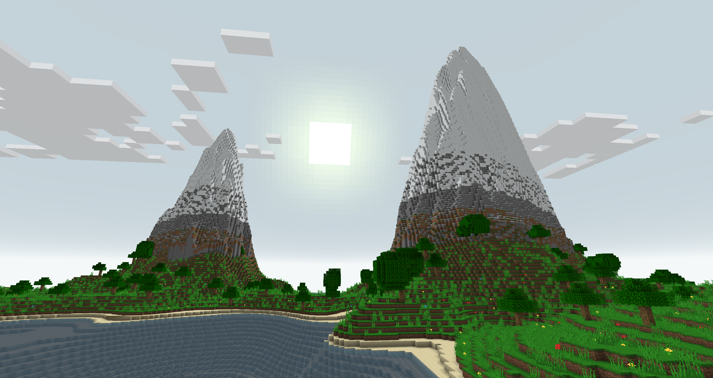

# MineCPP (Fiber)

Fiber is a scalable server backend for Minecraft Java Edition written in C++.
The currently supported version of Minecraft is **1.18.2**.
The main goal of the server is to be horizontally scalable. The server requires
a decided load balancer called "front" as well as a separate chunk database. (called chunk storage)
The server is an early stage of development.


 
## Installation

The target platform of the server x86_64 linux. It is probably possible to run the server on other platforms
but that wasn't attempted yet.
The easiest way to run the server is through docker. If you have docker and docker-compose installed on your system.
Just run `make docker-run`. All the necessary docker images will be built and the server will start through docker compose.
If you want to just build the images run `make docker`. Docker compose file can be started with a simple `docker-compose up` command.

### Building from source

Follow the build processes specified in a docker file at `docker/BuildBase.Dockerfile`.
The build system is `cmake` the C++ standard is 20. The following dependencies are needed for everything:

+ **fmt**
+ **spdlog**
+ **gtest**
+ **boost:**
    - iostreams
    - system
    - program options
+ **flex**
+ **google benchmark**
+ **protobuf**
+ **gRPC** _(may be provided with fetch content with cmake option **-DUSE_LOCAL_GPRC=OFF**)_
+ **yaml-cpp** _(provided through cmake fetch content)_
+ **mb** _(provided through cmake fetch content)_
+ **mb-codegen** _(provided through cmake fetch content)_

All the targets should compile on both `gcc` and `clang`. Please use recent version of gRPC (at least 1.45) and a matching
version of protobuf. Remember to regenerate proto files using `protogen.sh` script for your version of gRPC. (`protoc` and `grpc_cpp_plugin`)
You can build the server using standard CMake build procedure. Specify `-DUSE_LOCAL_GPRC=OFF` flag if you want to build gRPC
using CMake's fetch content.

```bash
mkdir -p build
cd build
cmake .. -DCMAKE_BUILD_TYPE=Release
cmake --build . -j $(nproc)
```

## Configuration

The configuration is done by environmental variables or a yaml file. (in case of the front service)

### Front service

Front service reads `CONFIG_FILE` environmental variable (the default value is `config.yml`)
that specifies a yaml configuration file. Example configuration:

```yaml
engine_hosts:
  - "127.0.0.1:7000"
recipes: /config/research/recipes.dat
tags: /config/research/tags.dat
chunk_storage_host: 127.0.0.1:7000
```

Recipes and tags are not used anymore, although the service will fail without them. These files are provided within
the research directory. The listen port is provided through `PORT` environmental variable. (the default value is `25565`)

### Engine

The engine reads the following environmental variables.

+ **LISTEN** (default value `0.0.0.0:7600`) - The listen host.
+ **CHUNK_STORAGE_ADDRESS** (default value `127.0.0.1:7000`) - Address of the chunk storage service.
+ **REPOSITORY_FILENAME** (default value `repository.bin`) - A file with all the game resources. (Available at `repository.bin`)

### Chunk Storage

The chunk storage reads the following environmental variables.

+ **LISTEN** (default value `0.0.0.0:7600`) - The listen host.
+ **REPOSITORY_FILENAME** (default value `repository.bin`) - A file with all the game resources. (Available at `repository.bin`)
