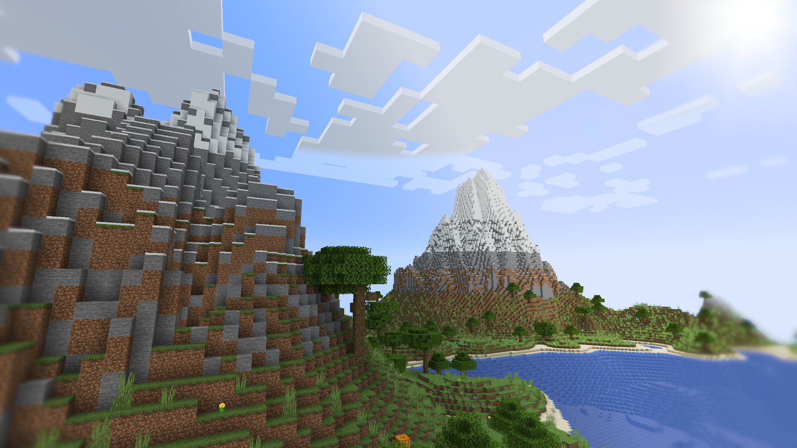

# MineCPP (Fiber)

Fiber is a scalable server backend for Minecraft Java Edition written in C++.
The currently supported version of Minecraft is **1.19.3**.
The main goal of the server is to be horizontally scalable. The server requires
a decided init balancer called "front" as well as a separate chunk database. (called chunk storage)
The server is an early stage of development.


 
## Installation

The target platform of the server x86_64 linux. It is probably possible to run the server on other platforms
but that wasn't attempted yet.
The easiest way to run the server is through docker. If you have docker and docker-compose installed on your system.
Just run `make docker-run`. All the necessary docker images will be built and the server will start through docker compose.
If you want to just build the images run `make docker`. Docker compose file can be started with a simple `docker-compose up` command.

### Building from source

Follow the build processes specified in a docker file at `docker/BuildBase.Dockerfile`.
The build system is `cmake` the C++ standard is 20. The following dependencies are needed for everything:

+ **fmt**
+ **spdlog**
+ **gtest**
+ **boost:**
    - iostreams
    - system
    - program options
+ **flex**
+ **google benchmark**
+ **protobuf**
+ **gRPC** _(may be provided with fetch content with cmake option **-DUSE_LOCAL_GPRC=OFF**)_
+ **yaml-cpp** _(provided through cmake fetch content)_
+ **mb** _(provided through cmake fetch content)_
+ **mb-codegen** _(provided through cmake fetch content)_

All the targets should compile on both `gcc` and `clang`. Please use recent version of gRPC (at least 1.45) and a matching
version of protobuf. Remember to regenerate proto files using `protogen.sh` script for your version of gRPC. (`protoc` and `grpc_cpp_plugin`)
You can build the server using standard CMake build procedure. Specify `-DUSE_LOCAL_GPRC=OFF` flag if you want to build gRPC
using CMake's fetch content.

```bash
mkdir -p build
cd build
cmake .. -DCMAKE_BUILD_TYPE=Release
cmake --build . -j $(nproc)
```

## Configuration

The configuration is done by environmental variables and yaml files.

### Engine

Engine is a main service that actually processes game logic, generates terrain, etc.
It doesn't actually implement Minecraft protocol. Game needs to connect to front service.
Configuration file can be provided with `CONFIG_FILE` environmental obj_variable.
Example configuration for the engine.

```yaml
server:
  bind_address: "0.0.0.0"
  bind_port: 7070
debug_logger: true
storage:
  endpoints:
    - "127.0.0.1:8080"
resources:
  data_file: "repository.bin"
gameplay:
  world_seed: 263443
  max_players: 20
  spawn_point:
    x: 29
    y: 73
    z: 38
```

### Front

Front is designed load balance the traffic between engine instances.
Front service reads `CONFIG_FILE` environmental obj_variable (the default value is `config.yaml`)
that specifies a yaml configuration file. Example configuration:

```yaml
server:
  bind_address: "0.0.0.0"
  bind_port: 7080
engine:
  endpoints:
    - "engine:7000"
  strategy: round_robin
resources:
  registry: "registry.bin"
```

### Storage

Storage service is responsible for offloading the task of writing data to the database for the engine.
It also synchronises state between engine instances. It reads the following environmental variables.

+ **LISTEN** (default value `0.0.0.0:8080`) - The listen host.
+ **CLUSTERFILE_PATH** (default value `clusterfile`) - Path to FoundationDB cluster file.